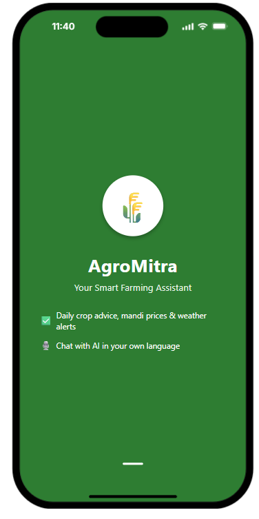
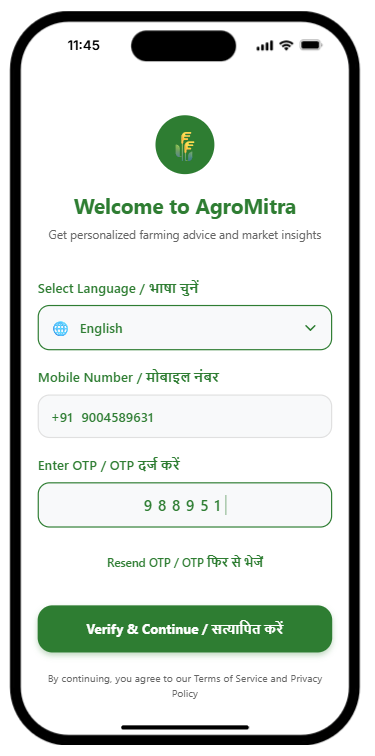
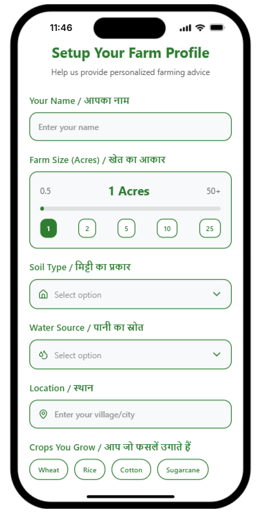
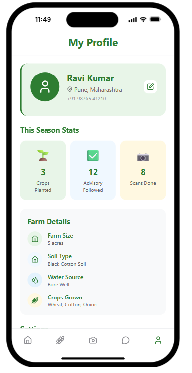
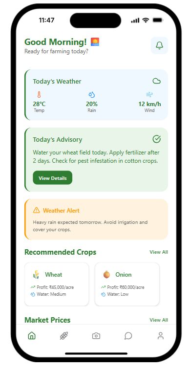
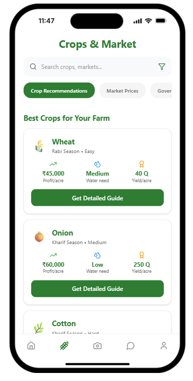
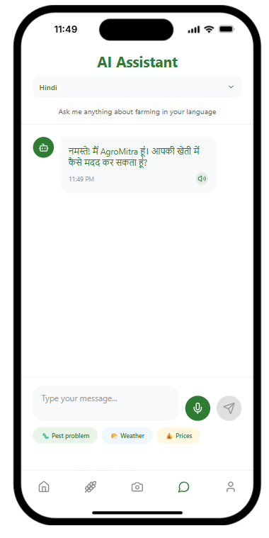
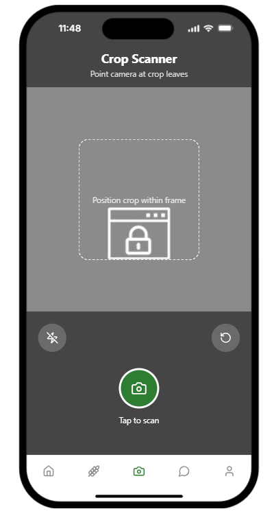
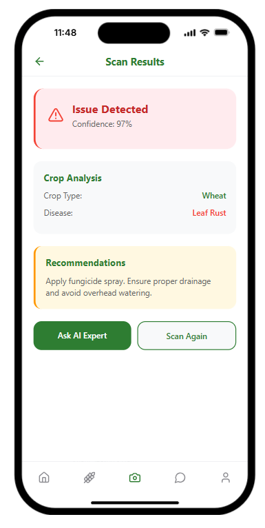

# 🌱 AgroMitra - Smart Farming Assistant

AgroMitra is an AI-powered mobile application designed for farmers to simplify crop management, disease detection, and access to real-time market prices.  
The app focuses on **simplicity, multilingual support, and farmer-friendly UI** with both **light & dark modes**.

---

## 🚀 Features

- 📱 **Easy Login/Signup** with mobile number  
- 🏠 **Dashboard (Home)** – Weather, tips, and alerts  
- 🌾 **Crops Section** – Crop info, growth techniques, and disease prevention  
- 📷 **AI Scan** – Detects crop diseases & gives crop details using image recognition  
- 🛒 **Market Prices** – Real-time mandi prices & nearby markets  
- 👤 **Profile** – Manage user info, preferences, and settings  
- 🤖 **AI Helper** – Floating voice+text chatbot with multilingual support  
- 🌗 **Day/Night Mode** – Default in **light mode**, toggle for dark mode  

---

## 🏗️ Tech Stack

- ⚛️ React Native / Expo  
- 🎨 CSS / Styled Components  
- 🔥 AI/ML APIs (for disease detection & chatbot)  
- ☁️ Firebase / Node.js backend (optional for auth & data storage)  

---

## 📂 Project Structure

📂 SIH PROJECT
 ┣ 📂 mobile
 ┣ 📂 web
 ┣ 📂 screenshots
     ┣ chatbot.png
     ┣ crops_&_market.png
     ┣ home.png
     ┣ intro.png
     ┣ login_and_authentication.png
     ┣ profile_setup.png
     ┣ profile.png
     ┣ scan-I.png
     ┗ scan-result.png

## 📸 Screenshots

### 🔐 Authentication & Profile






---

### 🏠 Main Features



---

### 🤖 Chatbot & Scanning




---

### 📱 Mobile View
<p align="center">
  
  
</p>

<p align="center">
  
  
</p>

<p align="center">
  
  
</p>

<p align="center">
  
  
</p>


⭐ All screens support **🌞 Light Mode** and **🌙 Dark Mode** with a toggle available on every page.


---

## ⚡ Installation

```
bash
# Clone repo
git clone https://github.com/YourUsername/AgroMitra.git](https://github.com/mudassir0011a/SIH-Project_PS-ID-SIH25010_AgroMitra.git

# Go to project folder
cd AgroMitra/apps/mobile

# Install dependencies
npm install

# Run project
npm start

